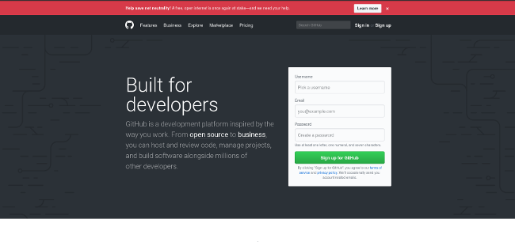
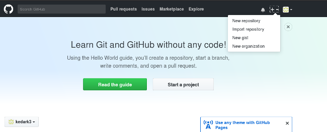

# A step by step guide to Git
# Step 1: Create a GitHub account






# Step 2: Create a new repository

A repository is like a place or a container where something is stored; in this case we're creating a Git repository to store code. To create a new repository, select New Repository from the + sign dropdown menu (you can see I've selected it in the upper-right corner in the image above).



Enter a name for your repository (e.g, "Demo") and click Create Repository.

# Step 3: Create a file


 Look at the section that starts "...or create a new repository on the command line," and ignore the rest for now.

Open the Terminal program on your computer.




Type git and hit Enter. If it says command bash: git: command not found, then install Git with the command for your Linux operating system or distribution. Check the installation by typing git and hitting Enter; if it's installed, you should see a bunch of information about how you can use the command.

In the terminal, type:

mkdir Demo
This command will create a directory (or folder) named Demo.

Change your terminal to the Demo directory with the command:

cd Demo
Then enter:

echo "#Demo" >> README.md
This creates a file named README.md and writes 

cat README.md
This will show you what is inside the README.md file, if the file was created correctly. 


To tell your computer that Demo is a directory managed by the Git program, enter:

git init
Then, to tell the Git program you care about this file and want to track any changes from this point forward, enter:

git add README.md


# Step 4: Make a commit
So far you've created a file and told Git about it, and now it's time to create a commit. Commit can be thought of as a milestone. Every time you accomplish some work, you can write a Git commit to store that version of your file, so you can go back later and see what it looked like at that point in time. Whenever you make a change to your file, you create a new version of that file, different from the previous one.

# Step 5: Connect your GitHub repo with your computer

Now, it's time to connect your computer to GitHub with the command:

git remote add origin https://github.com/<your_username>/Demo.git
Let's look at this command step by step. We are telling Git to add a remote called origin with the address https://github.com/<your_username>/Demo.git (i.e., the URL of your Git repo on GitHub.com). This allows you to interact with your Git repository on GitHub.com by typing origin instead of the full URL and Git will know where to send your code. Why origin? Well, you can name it anything else if you'd like.

Now we have connected our local copy of the Demo repository to its remote counterpart on GitHub.com. Your terminal looks like this:



And if you go to https://github.com/<your_username>/Demo you will see something like this:







# Working collaboratively with more than Two person in Simple Steps:



## On Github we have a master branch and a dev branch

* The master branch is the same as production or contains deployment ready code

* The dev branch is ahead of master and contains all new code currently being worked on

* Locally we three work on the dev branch and push to github when something is ready

* The other dev fetches any new changes from the dev branch before pushing his new code

* When dev branch is good,we merge with the master branch

* Locally we have several feature branches issue branches etc.

Conflicts generally arise when two people have changed the same lines in a file, 

# Creating a merge conflict

In order to get real familiar with merge conflicts, the next section will simulate a conflict to later examine and resolve. The example will be using a Unix-like command-line Git interface to execute the example simulation.

* $ mkdir git-merge-test
* $ cd git-merge-test
* $ git init .
* $ echo "this is some content to mess with" > merge.txt
* $ git add merge.txt
* $ git commit -am"we are commiting the inital content"
[master (root-commit) d48e74c] we are commiting the inital content

create mode 100644 merge.txt

This code example executes a sequence of commands that accomplish the following.

* Create a new directory named git-merge-test, change to that directory, and initialize it as a new Git repo.
* Create a new text file merge.txt with some content in it.  
* Add merge.txt to the repo and commit it.
* Now we have a new repo with one branch master and a file merge.txt with content in it. Next, we will create a new branch to use as the conflicting merge.

* $ git checkout -b new_branch_to_merge_later
* $ echo "totally different content to merge later" > merge.txt
* $ git commit -am"edited the content of merge.txt to cause a conflict"
[new_branch_to_merge_later 6282319] edited the content of merge.txt to cause a conflict
1 file changed, 1 insertion(+), 1 deletion(-)
This chain of commands checks out the master branch, appends content to merge.txt, and commits it. This now puts our example repo in a state where we have 2 new commits. One in the master branch and one in the new_branch_to_merge_later branch. At this time lets git merge new_branch_to_merge_later and see what happen!


* $ git merge new_branch_to_merge_later
* Auto-merging merge.txt
* CONFLICT (content): Merge conflict in merge.txt
 Automatic merge failed; fix conflicts and then commit the result
           
 Merge Conflict Arises




# How to resolve merge conflicts using the command line

The most direct way to resolve a merge conflict is to edit the conflicted file. Open the merge.txt file in your favorite editor. For our example lets simply remove all the conflict dividers. The modified merge.txt content should then look like:

* this is some content to mess with
 content to append
 totally different content to merge later
* Once the file has been edited use git add merge.txt to stage the new merged content. To finalize the merge create a new commit by executing:

* git commit -m "merged and resolved the conflict in merge.txt"
Git will see that the conflict has been resolved and creates a new merge commit to finalize the merge.

# Git commands that can help resolve merge conflicts

* git status
The status command is in frequent use when a working with Git and during a merge it will help identify conflicted files.

* git log --merge
Passing the --merge argument to the git log command will produce a log with a list of commits that conflict between the merging branches.


* git diff
diff helps find differences between states of a repository/files. This is useful in predicting and preventing merge conflicts.

Tools for when git fails to start a merge
* git checkout
checkout can be used for undoing changes to files, or for changing branches

* git reset --mixed
reset can be used to undo changes to the working directory and staging area.

Tools for when git conflicts arise during a merge
* git merge --abort
Executing git merge with the --abort option will exit from the merge process and return the branch to the state before the merge began.

Tools for when git fails to start a merge
* git checkout
checkout can be used for undoing changes to files, or for changing branches

* git reset --mixed
reset can be used to undo changes to the working directory and staging area.

Tools for when git conflicts arise during a merge
* git merge --abort
Executing git merge with the --abort option will exit from the merge process and return the branch to the state before the merge began.

* git reset
Git reset can be used during a merge conflict to reset conflicted files to a know good state

Credit-https://opensource.com/article/18/1/step-step-guide-git
            https://www.atlassian.com/git/tutorials/using-branches/merge-conflicts


# Contributor
## Soham Banerjee - sb2344



































