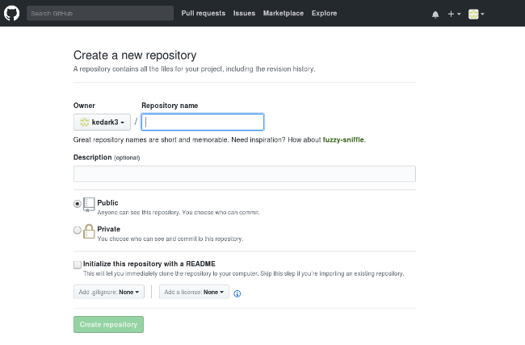

# A step by step guide to Git
# Step 1: Create a GitHub account






# Step 2: Create a new repository

A repository is like a place or a container where something is stored; in this case we're creating a Git repository to store code. To create a new repository, select New Repository from the + sign dropdown menu (you can see I've selected it in the upper-right corner in the image above).



Enter a name for your repository (e.g, "Demo") and click Create Repository.

# Step 3: Create a file


 Look at the section that starts "...or create a new repository on the command line," and ignore the rest for now.

Open the Terminal program on your computer.















