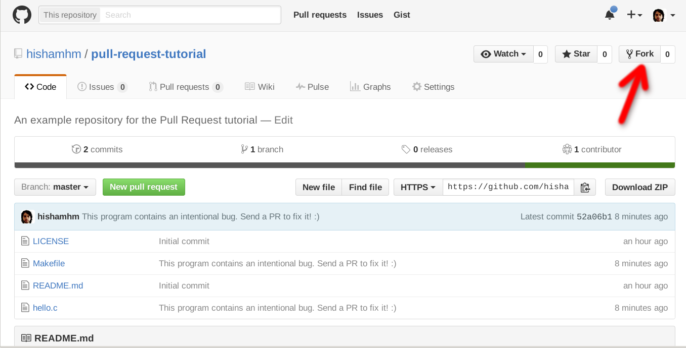

# Understanding Forking vs Clonning

## Fork
A fork is a copy of a repository. Forking a repository allows you to freely experiment with changes without affecting the original project.



## Clone
The clone command downloads an existing Git repository to your local computer.
You will then have a full-blown, local version of that Git repo and can start working on the project.



## Difference
 Cloning downloads a copy of the repository to your local machine while forking copies the repository to your github account (still hosted on github), making it appear under the list of your repositories.

# Pull Request


When you file a pull request, all you’re doing is requesting that another developer (e.g., the project maintainer) pulls a branch from your repository into their repository. This means that you need to provide 4 pieces of information to file a pull request: the source repository, the source branch, the destination repository, and the destination branch.

* A developer creates the feature in a dedicated branch in their local repo.

* The developer pushes the branch to a public GitHub repository.

* The developer files a pull request via GitHub.

* The rest of the team reviews the code, discusses it, and alters it.

* The project maintainer merges the feature into the official repository and closes the pull request.





* In their simplest form, pull requests are a mechanism for a developer to notify team members that they have completed a feature. 
* Once their feature branch is ready, the developer files a pull request via their GitHub account. 
* This lets everybody involved know that they need to review the code and merge it into the master branch.



* But, the pull request is more than just a notification—it’s a dedicated forum for discussing the proposed feature. 
* If there are any problems with the changes, teammates can post feedback in the pull request and even tweak the feature by pushing follow-up commits. 
* All of this activity is tracked directly inside of the pull request.

# Adding a Collaborator to a GitHub Repo

* You’re a team player, so you’re going to need to add your team to your repo so they can collaborate. Once your team is added as collaborators they’ll be able to push, merge, and a ton of other destructive things so make sure you’re only adding your teammates.
Click on the “Settings” tab of your rep, then “Collaborators” then search for Github users and add them by clicking “Add Collaborator”:



* They’ll receive an email letting them know you added them and will be listed as a collaborator.

* If you’re a collaborator, go to the Github Repo page, Git Clone the project, and cd into the directory. Don’t fork it! Forking will copy it in a new Repo to your Github page, but you don’t want that — you want to collaborate on the same Github Repo with your teammates.

When you’re using git to work on the same project with multiple people, there’s one central rule one must follow:

## THE MASTER BRANCH SHOULD ALWAYS BE DEPLOYABLE

The way to keep Master deployable is to create new branches for new features and merge them into Master when they’re completed. Here’s how that works.

To start, branches should always represent features. For example, if you want to add the ability for a user to login you should probably create a branch called “user_authentication” and in that branch you should only update what you need to to enable a user to login.

It’s also important when collaborating that your team picks features that don’t have overlapping code. 

* For example, you shouldn’t be working on a “user_login” branch at the same time that your teammate is working on a “user_logout” branch because the chances that you’re working on the same files and are writing overlapping code are very high.










