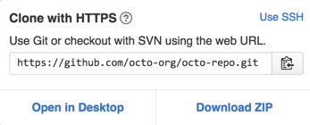

# Understanding Forking vs Clonning
## Fork
A fork is a copy of a repository. Forking a repository allows you to freely experiment with changes without affecting the original project.



## Clone
The clone command downloads an existing Git repository to your local computer.
You will then have a full-blown, local version of that Git repo and can start working on the project.



## Difference
 Cloning downloads a copy of the repository to your local machine while forking copies the repository to your github account (still hosted on github), making it appear under the list of your repositories.


